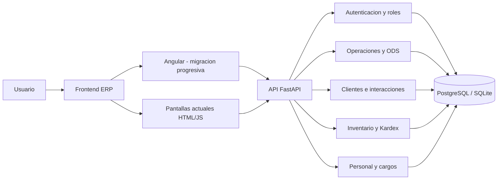
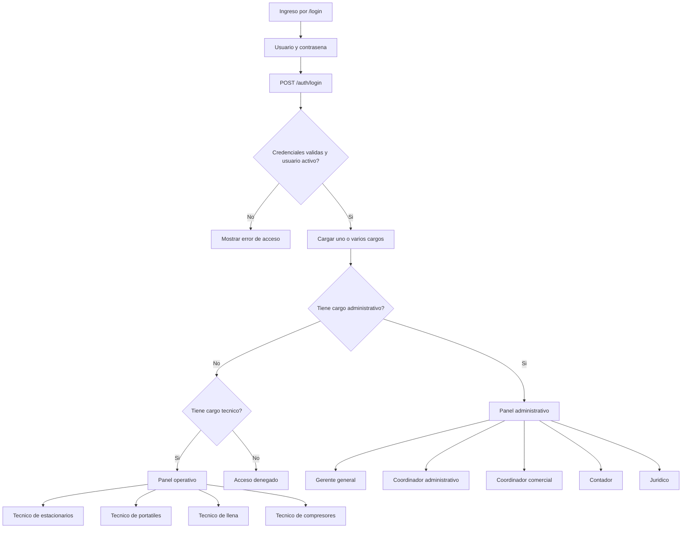
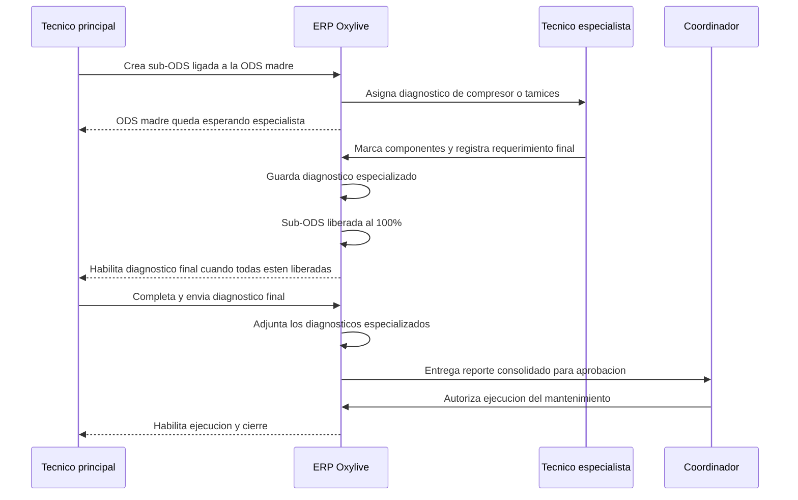
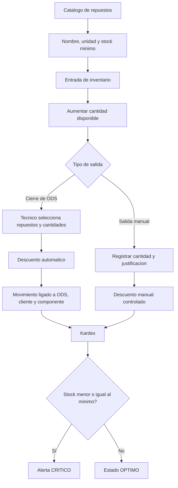
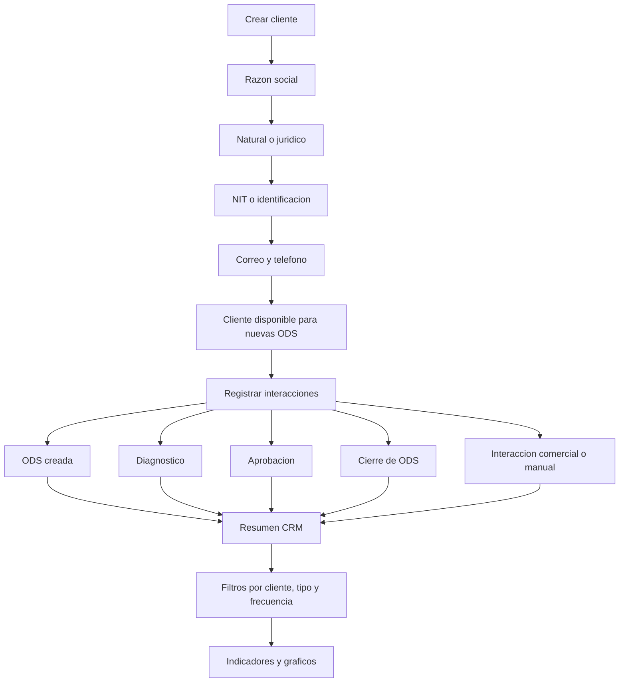
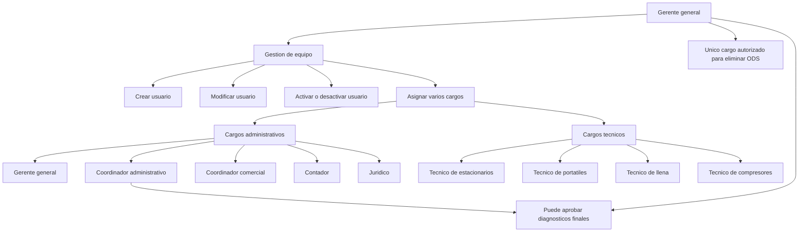
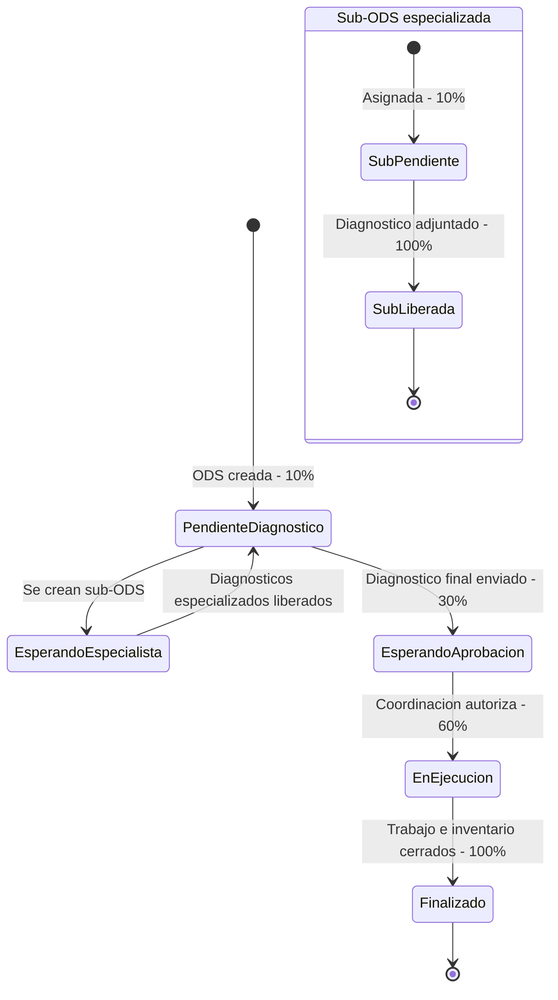

# Diagrama completo de procesos - ERP Oxylive

## 1. Arquitectura general

## 2. Acceso y distribucion por cargos

## 3. Ciclo completo de una ODS

```mermaid
flowchart TD
    A["Crear ODS"] --> B["Seleccionar cliente"]
    B --> C["Registrar servicio y equipo"]
    C --> D["Tipo, marca, modelo, horas y modalidad"]
    D --> E{"Es llenado o recarga de tamices?"}
    E -- "Si" --> F["Registrar tabla de tamices: marca, cantidad y unidad/par"]
    E -- "No" --> G["Continuar con datos del equipo"]
    F --> H["Asignar tecnico principal"]
    G --> H
    H --> I["Estado: PENDIENTE DIAGNOSTICO - 10%"]

    I --> J{"Tecnico principal diagnostica directamente?"}
    J -- "Si" --> K["Diagnostico integral de estacionario o portatil"]
    J -- "No, transmite" --> L["Crear sub-ODS con el mismo numero de ODS"]

    L --> M{"Tipo de diagnostico especializado"}
    M -- "Compresor" --> N["Asignar a tecnico de compresores"]
    M -- "Tamices" --> O["Asignar a tecnico de llena"]

    N --> P["Diagnostico especializado de compresor"]
    P --> P1["Anillos, empaques, bielas, camisas, tapas y soportes"]
    P1 --> P2["Registrar requerimiento final del componente"]

    O --> Q["Diagnostico especializado de tamices"]
    Q --> Q1["Llenado, columnas, tapas y o-rings"]
    Q1 --> Q2["Registrar requerimiento final del componente"]

    P2 --> R["Adjuntar diagnostico a ODS madre"]
    Q2 --> R
    R --> S["Sub-ODS: DIAGNOSTICO LIBERADO - 100%"]
    S --> T{"Todas las sub-ODS fueron liberadas?"}
    T -- "No" --> U["ODS madre espera al especialista"]
    U --> T
    T -- "Si" --> V["Habilitar diagnostico final del tecnico principal"]

    K --> W["Preparar diagnostico final"]
    V --> X["Consolidar diagnosticos especializados"]
    X --> W
    W --> Y["Enviar reporte final a coordinacion"]
    Y --> Z["Estado: ESPERANDO APROBACION - 30%"]

    Z --> AA["Gerente o coordinador administrativo revisa reporte"]
    AA --> AB["Autorizar inicio del mantenimiento"]
    AB --> AC["Estado: APROBADO - EN EJECUCION - 60%"]
    AC --> AD["Tecnico ejecuta mantenimiento"]
    AD --> AE["Seleccionar repuestos utilizados"]
    AE --> AF["Cerrar ODS"]
    AF --> AG["Descontar inventario y registrar Kardex"]
    AG --> AH["Estado: FINALIZADO - 100%"]
```

## 4. Consolidacion del diagnostico especializado

## 5. Inventario y Kardex

## 6. Clientes e interacciones

## 7. Personal, cargos y permisos

## 8. Estados principales

